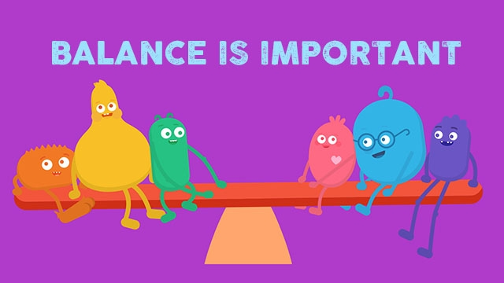
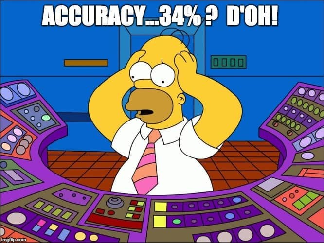
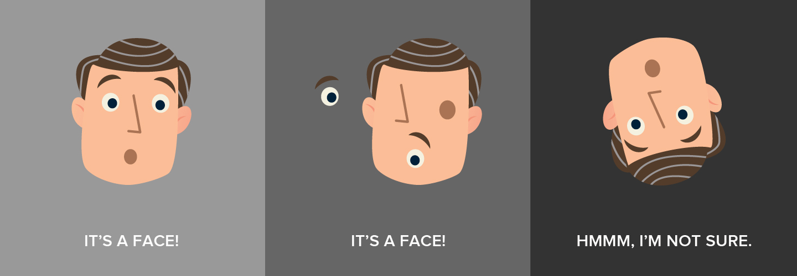

# Meme-Generator (MemeGen)

https://ritheeshbaradwaj.pythonanywhere.com/

MemeGen is a web application which generates memes automatically according to the given image. All the user has to do is upload a clear picture,and our application analyses the expression of the person in the image producing amusing memes. The user also has an option of downloading the image from the webpage.

  

### **Here are a few images generated by MemeGen:**

  
   
  

## How it works:
The understanding of working of this project will require you to understand a few fancy terms such as:

* Undersampling
* Oversampling
* Image Augmentation 
* Convolutional Neural Networks
* Auto ML

It is little wonder that there was a huge image dataset playing its part behind the scenes. Image datasets brings in the importance of CNN with it. If you are new to the term, keep reading! 
___________________________________

## **Balanced data:**

First off, let us understand the importance of **good data** and more importantly, a **balanced data**. In simple terms, balanced data is a case where we have equal or almost equal data for all the available classes. 

> 

### ***So what happens if they aren't equal?***

The possible answer to that question is that your model will end up being crappy, credits to the dataset! This happens because.. when you train a model with 1000 images of Class A and 300 images of Class B, quite evidently, the model sees more of Class A and when you show it an image of Class B and ask it to predict, chances are, it will predict the image to be A reasons being obvious. If this doesn't seem very likely, imagine a model trying to strike a balance between 10 classes with data for each class varying humongously (10000, 800, 350, 500...). 

>  

### Now the question is, how do we overcome this problem? 

> So there are two feasible solutions, **Oversampling** and **Undersampling**! In simple words,

* If we reduce the data of majority class to match the amount of data of minority class and literally reduce the samples, the process would be called __*undersampling*__. 

*  If we do not want to miss out on the quality data we've caught hold of, and somehow manage to increase the samples of the other class which has less data, we end up increasing the number of samples in total, which is termed as __*oversampling*__. 

Moral of the story, oversampling and undersampling in data analysis are techniques used to adjust the class distribution of a data set. 
________________________________________________

### **Image Augmentation:**
Image augmentation is a technique that is used to artificially expand the dataset. This is helpful when we are given a dataset with very few data samples. It can be considered as a method of oversampling the main difference being, Augmentation is done when you don't have enough data on the whole (for all classes combined), whereas oversampling is a technique used when you don't have enough data in one class. 

> 
-----------
Now that we have enough data and are ready to build a model, which procedure do you think would give us the best output? Combination of deep learning and images immediately rings a familiar bell in our minds, absolutely, Convolutional Neural Networks!

> *CNN is a type of Artificial Neural Network, the other types being MLP, RNN, Shallow neural networks, sequence-to-sequence models etc. ANN is inspired by the way the biological nervous system processes information. It is composed of large number of highly interconnected processing elements (neurons) working in unison to solve a specific problem. The model of MemeGen, is based on CNN algorithm, so let's see in brief what exactly it does.*
________________________________________________
## **Convolutional Neural Networks (CNN):**
As the name suggests, CNN works quite similar to how the neurons of a human brain work. Have you ever paid keen attention to how our mind identifies people, objects and the other worldly things? It happens so swiftly that most of us never even give a second thought to it. When we see an image, we scan the image to understand the different features of the image. Our mind then combines the different local features that we scanned in order to classify the image. This is exactly how CNN also works. It takes an image, breaks it down into several equal parts and analyses it followed by overlapping the comprehended results of each such part. 

> 

CNN can be understood by clearly associating it with two important elements:

    1. Convolutional Layer
    2. Kernel K

Convolutional layer is core building block of CNN, it helps with feature detection.
Kernel K is a set of learnable filters and is spatially small compared to the image but extends through the full depth of the input image.

Here is a very satisfying metaphor we found on the Internet about how CNN works:

 *If you were a detective and you are came across a large image or a picture in dark, how will you identify the image? You will use a           flashlight and scan across the entire image. This is exactly what we do in convolutional layer. Kernel K, which is a feature detector is equivalent of the flashlight on image I, and we are trying to detect feature and create multiple feature maps to help us identify or classify the image. We have multiple feature detector to help with things like edge detection, identifying different shapes, bends or different colors etc.*

> CNN has several advantages over the conventional image classification methods, one of them being transational invariance which typically means that it identifies an object even if it is translated, rotated or slightly deformed.

This was just a brief on CNN, it actually seems simple but in reality involves a lot of mathematical calculations and understanding of neural networks. If you want to know more about CNN, [click here.](https://towardsdatascience.com/simple-introduction-to-convolutional-neural-networks-cdf8d3077bac)
_____________________________________________

## **Auto ML:**
As you can guess, Auto ML is the process of automatically training a Machine Learning model and finding the best possible model when a dataset is provided. 

> 

In our case, we used 3 different datasets to get the best end results.

* _First dataset:_ Japanese faces
* _Second dataset:_ Pictures of faces Indian actors 
* _Third dataset:_ Images of faces of famous personalities

Here is an example of how it works:
>| Accuracies| Japanese (A) | Actors (B) | Famous Personalities (C)|
>|----------|----------|--------|----------------------|
>| **Sad**  |     60%  |   50%  |      25%             |
>| **Happy**|    45%   |   75%  |        39%           |

A point to notice here is that the model A gives a good precision for *Sad* expression and 60% of the times it is correct, whereas model C gives a bad precision for Sad faces and predicts it to be some other expression predicting approximately 25% of the times right. Hence we assign weights to the models for each class (expressions) to conjure up the best possible results.
> For example, for sad expression the weight of model A would be 0.8 and that of B and C would be 0.3 and 0.1 respectively. 

This ensures that all the existing models play their part appropriately and provide most accurate results. 
_________________________________

### **Other tech stack used in MemeGen:**
In addition to this, we've also used the following in building **MemeGen:**

    1. Flask as a framework 
    2. Chef as Configuration Management tool
    3. Google Cloud Platform as Cloud Service 

To know what the above terms mean and do, please visit our ["Covid19 Feedback Application"](https://developers-cosmos.github.io/COVID19-FeedbackApplication/) repository where we have explained it clearly in detail. 

### Hope you enjoyed MemeGen!
## Any suggestions are welcome. Thanks a ton! :D

